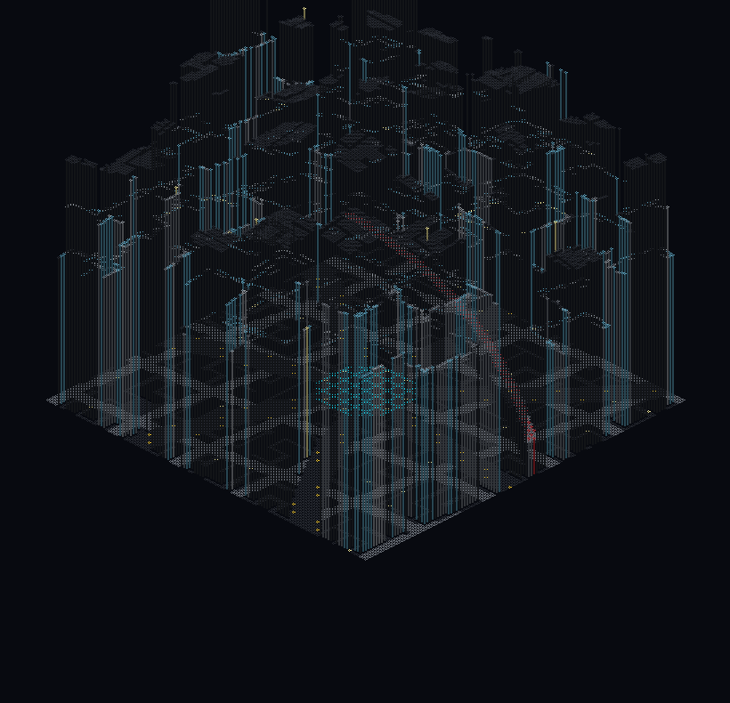

# Neon Megacity Generator

An infinite, deterministic cyberpunk city generator for Minecraft 26.2 and NeoForge. Neon City builds original metropolitan centers, six connected districts, warped streets, stacked transit, canals, parks, and dense service alleys as players explore.



The runtime mod uses original procedural code and Minecraft's built-in block palette. It does **not** bundle textures, models, maps, characters, logos, or other assets from an existing cyberpunk franchise. The real-city studies in `provenance/` inform aggregate urban statistics only; their source geometry and generated worlds are not copied into the runtime city.

## City grammar

The world is not an endlessly repeated chunk template. Global coordinates are resolved against the nearest metropolitan center in a 1,536-block lattice. Every center except the origin is deterministically jittered by up to 200 blocks on each axis, then assigned its own identity. That identity varies district phase, roads, parcels, height, and detail while keeping the result stable across restarts and across negative coordinates.

Within each metropolis:

- A warped monumental core gives way to five angular district wedges and an irregular outer belt shared by the Foundry Belt and Understacks.
- A central plaza, a rippling inner arterial ring, and seven curved radial avenues establish the primary network.
- District-specific local grids are rotated and continuously warped, so streets and parcels share boundaries without becoming a rigid checkerboard.
- A raised expressway follows a broad, uneven outer ring at Y 23; a sinuous elevated rail spine runs at Y 33. Both include supports, and the harbor adds a curving canal.
- Every 96×96-block sector contains an 8×8 perfect depth-first-search maze of 2–4-block-wide service alleys. Shared edge portals keep the maze connected across sector and chunk seams.
- Buildings are sampled in world space, so shells, floors, roads, bridges, and alleys continue cleanly across chunk boundaries.

Generation is theoretically unbounded, but only queued, loaded chunks are built.

## Six districts

| District | Parcel / height grammar | Character |
| --- | --- | --- |
| **Crown Core** | 48-block parcels; 132–292-block towers, with central crowns up to Y 304 | Monumental blackstone skyline, stepped towers, cyan light crowns, and the origin plaza |
| **Kairocho** | 28-block parcels; 34–108-block mixed-use buildings | Dense, narrow fabric with dark tile, timber, red glass, amber light, and the tightest local streets |
| **Longwei Harbor** | 50-block parcels; 82–238-block towers plus occasional landmarks | Large red, copper, teal, and gold podiums along a curving canal |
| **Haneul Tech Quarter** | 42-block parcels; 72–208-block corporate towers | White and quartz massing, blue glass, purple accents, diagonal streets, and crisp rooflines |
| **Foundry Belt** | 58-block parcels; 18–58-block buildings | Broad, low industrial fabric in tuff, weathered copper, iron, and orange light |
| **Understacks** | 24-block parcels; 22–82-block buildings | Compressed low-rise blocks in mud brick, copper, deepslate, and magenta light |

## Urban-profile provenance

Kairocho, Haneul Tech Quarter, and Longwei Harbor were calibrated from saved Arnis 3.0.0 studies of Tokyo/Shinjuku, Seoul/Gangnam, and Shanghai/Lujiazui. `tools/compile_cultural_profiles.py` reduces the saved OSM observations to auditable distributions rather than stitching incompatible Arnis projections or importing individual buildings.

| Profile | Footprint coverage | Median footprint | Median tagged height | Road orientation entropy | Procedural intent |
| --- | ---: | ---: | ---: | ---: | --- |
| Tokyo / Shinjuku | 33.86% | 87.9 m² | 22.4 m | 0.926 | Tight mixed parcels, rail megablocks, layered alleys |
| Seoul / Gangnam | 26.65% | 179.4 m² | 44.0 m | 0.779 | Corporate podiums, diagonal side streets, glass towers |
| Shanghai / Lujiazui | 11.78% | 631.2 m² | 64.0 m | 0.990 | Monumental towers, river curves, large red-gold-teal podiums |

The complete distributions, road classes, source hashes, and bounding boxes are in [`cultural_profiles.json`](src/main/resources/data/neoncity/cultural_profiles.json) and `provenance/cultural_profiles_build.json`. These profiles are evidence for the baked generator parameters; the Java runtime does not currently load them as live configuration.

The bundled Tokyo, Seoul, and Shanghai extracts contain OpenStreetMap data, © OpenStreetMap contributors, made available under the [Open Database License](https://www.openstreetmap.org/copyright). Arnis-derived Minecraft world exports are reproducible local evidence and are intentionally excluded from Git; their source extracts, hashes, and audits remain versioned.

## Create a world

Neon City is intentionally opt-in. Its generator activates only when the overworld uses the dedicated `neoncity:megacity` preset, whose final two non-air flat layers are black concrete followed by cyan concrete.

1. Install the built JAR in a Minecraft 26.2 + NeoForge 26.2.0.7-beta instance.
2. Choose **Create New World** and open the world settings.
3. Select **Neon Megacity** (`neoncity:megacity`) as the world type **before** creating the save.
4. Enter the new world and confirm activation with `/neoncity status`.

Always use a fresh save. Adding the mod to an existing world does not convert it. The generator requires exactly two non-air flat layers—black concrete followed by cyan concrete—so unrelated flat worlds are not accepted accidentally.

At server start the mod synchronously prepares a 3×3-chunk spawn window and moves spawn to `(0, 2, 0)`. It then grows the city around loaded players.

## Commands

Both commands require game-master/operator permission (or cheats in single-player).

```text
/neoncity status
```

Reports whether generation is enabled, the persistent generated-chunk count, the transient queue size, and the generator fingerprint. `enabled=false` normally means the active overworld does not match the dedicated preset or its saved-data fingerprint is incompatible.

```text
/neoncity generate <chunkX> <chunkZ> <radius>
```

Queues an inclusive square around chunk coordinates, with `radius` from 0 through 12. For example, `/neoncity generate 0 0 3` requests a 7×7 area. The command skips chunks already generated or queued and does **not** force-load terrain: requested chunks are stamped only after Minecraft loads them.

## Performance and persistence

- A 15×15 chunk area (radius 7) is kept queued around each overworld player; player positions are sampled every 10 server ticks.
- The transient queue is capped at 768 chunks. Recent exploration displaces stale unloaded requests, preventing fast travel from growing an unbounded FIFO.
- Normal background work stamps at most one already-loaded chunk per server tick. Buildings are sparse shells with five-block floor spacing rather than solid volumes, and block updates skip unnecessary side effects.
- The initial 3×3 spawn prewarm is synchronous and may make first startup slower. Very tall or dense chunks can still cause a visible tick spike because placement runs on the server thread.
- Completed chunks are recorded in overworld `SavedData`. The ledger is restored on startup, prevents normal restamping, and is marked only after the entire chunk succeeds.
- If the server stops midway through a chunk, that uncommitted chunk is deterministically replayed. The queue itself is transient and is rebuilt around players after restart.
- The ledger stores a generator fingerprint. A layout-changing build with a different fingerprint disables generation in that save instead of silently overwriting player construction. There is not yet a migration command.

Back up worlds before updating the mod or testing large manual queues.

## Build and test

Requirements: Java 25 and the included Gradle wrapper. The project pins Minecraft 26.2, NeoForge 26.2.0.7-beta, and Gradle 9.2.1.

From this directory:

```bash
# Fast compile/resource check
./gradlew --no-daemon compileJava processResources

# Build build/libs/neoncity-1.0.1.jar
./gradlew --no-daemon build

# Run all registered NeoForge GameTests
./gradlew --no-daemon runGameTestServer

# Launch a development client for fresh-world validation
./gradlew --no-daemon runClient
```

The six Neon City regression tests cover DFS edge count and alley width, cross-sector alley portals,
all-district coverage, warped road and transit classes, skyline hierarchy, and deterministic sampling
at negative/global coordinates. Together with NeoForge's default harness test, the verification run
contains seven required tests.

Version 1.0.1 moves all Java classes into the unique `dev.modernity.neoncity` package. This prevents the Java module split-package crash that occurred when 1.0.0 was installed beside Infinite Taiwan Atlas (`city17`), whose template-era classes use `com.example.examplemod`.

Optional evidence tools:

```bash
# Recompile the three statistical profiles from the saved OSM inputs
python3 tools/compile_cultural_profiles.py

# Audit and render a generated 15×15-chunk world window
python3 tools/render_generated_world.py /path/to/world \
  --min-chunk -7 --max-chunk 7 --output-dir deliverable
```

The checked-in v2 audit records 225/225 parsed core chunks, 57,600 surface columns, 2,502,184 non-air blocks, and a maximum surface height of Y 304. Three additional 81/81-chunk audits cover the cultural districts. `client_plaza_night.png` and `client_aerial_night.png` are real managed-client captures from the exact built JAR; the top-down/isometric images are deterministic renders of the corresponding Anvil chunk data. See `deliverable/verification.json` for hashes and provenance.

## Current limitations

- **Fresh overworld only:** city construction is overworld-only and gated by the exact flat-layer signature. The preset retains vanilla Nether and End dimensions but does not urbanize them.
- **Fixed city seed:** every save uses the same deterministic city grammar. The Minecraft world seed does not yet alter centers, districts, alleys, or buildings.
- **Post-load stamping:** this is server-tick block construction, not a custom terrain `ChunkGenerator`. A newly loaded chunk can briefly show its flat base before the city pass finishes.
- **Architectural shells:** buildings have façades, floor plates, tiered roofs, and light crowns, but no authored interiors, doors, utilities, NPCs, or gameplay systems. Rail and expressway structures are infrastructure geometry, not a vehicle simulation.
- **Static cultural calibration:** the bundled profile JSON documents the design inputs; changing it alone does not retune runtime generation.
- **No save migration:** changing the generator fingerprint requires a new world or a future explicit migration tool. Already-recorded chunks are not regenerated by design.
- **Preview scope:** the checked-in render proves a finite 15×15-chunk origin window, while the pure tests verify the wider coordinate grammar. Long-distance multiplayer scale still needs soak and performance testing.

## License

The mod is currently marked **All Rights Reserved**. The NeoForge template terms are retained in [`TEMPLATE_LICENSE.txt`](TEMPLATE_LICENSE.txt).
